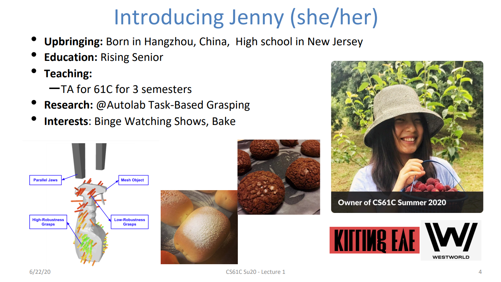

# CS61C学习总结

#### 课程介绍

CS61C(*Great Ideas in Computer Architecture*)是UC Berkeley开设的**计算机体系结构**&&**计算机组成**课程，从high level的C语言开始向下讲，到RISC-V汇编，再到更底层的CPU设计；后一小段课程会讲述一点OS、并行以及一些云计算的导论知识。虽然说这门课要求的先修课是CS61B（数据结构和算法），但其实可以跳过，直接开61C，两者的知识交集很小👀

#### 时间安排

前后花了一个半月的时间来刷完61c，总共大概要投入大概300h左右

#### 学习tips

1. 学习顺序：就我而言，是lecture->lab/hw->project，reading和discussion就没看了（~~英语太烂，文字读起来比较慢🤡~~)，但其实仅我做的三个部分就已经挺多了
2. 版本选择：我选择的是20su，授课的不是教授，是三个TA；summer课程只有26个lecture，但要学的东西并未缩减；但还是建议去上20fa，授课的是教授，课程也是完整的40个lecture，我在后期上了几节20fa的lecture，总的感觉是教授的授课水平以及视频的精良程度比TA的好🤔
3. 课程前面四个lecture快速过了一下C语言，然后就开始上手相应的lab和proj，但其实个人认为这个不是很合适，对C语言初学者不是很友好，包括学过C小C大的本菜狗🤡建议先上个Coursera上Duke的C programming spec，然后再跳过前面4个lecture，直接上手proj。关于C语言方面，可以看看我之前写的[C++自学总结](https://www.cc98.org/topic/5550820) 
4. 之后的RISC-V part，多多查阅[RISC-V GreenCard](https://inst.eecs.berkeley.edu/~cs61c/sp21/resources-pdfs/riscvcard.pdf) 以及学会在UCB提供的环境[venus](https://venus.cs61c.org/) 中debug，venus的功能很强大，有相关的文档教怎么使用，~~不要嫌多就草草略过，否则会和我一样debug很痛苦🤡~~ 有关RISC-V的proj2，虽然说听起来很高端，“用 RISC-V 汇编编写一个神经网络，用来识别 MNIST 手写数字 ”，但其实只是写几个矩阵运算，不用畏惧
5. 中后段的CPU part，要好好理解各组成的功能以及pipeline，proj3手搓CPU很酸爽；虽然说EE里数电和计组会有重合，但只能说关系不大，有关门电路的lecture不建议跳过
6. 后段的lecture不只局限于计组，包括SIMD（~~想起讲这个讲得稀碎的超算短学期~~）、线程级并行、虚存等等，有点为OS学习铺垫的意思
7. 这门课没有autograder，大部分都有本地测试，但有些是没有开放的（比如proj4，还挺可惜的😥），貌似可以申个UCB的summer session嫖个UCB的学生账户问TA要test，笔者没试过

#### 学习感想

1. 非常羡慕国外大学能给予TA相当大的权利，CS61C授课全程无教授参与，三个TA也讲得很好。其中的一个授课TA就是杭州人，还曾经在杭州网易实习过，~~说不定还有学长学姐认识~~

另外感慨一下华人在CS的绝对比重：61C的TA里，有快一半都是华人🤔回到正题：其实我觉得很多课，让比较优秀的学长学姐来讲能狠狠薄纱念祖传PPT（还有flash😆）的教授；貌似曾经图灵班的机器学习是胡神教的😍

2. 每每看到精致的课程主页，就会畅想，我活着的时间里能不能看到三本也有这样一门课呢🤔

3. 人文关怀无处不在：对于无数慕名而来的"non-Berkeley Students"，UCB也一样take into consideration；
     
  对于学生的关怀，总是有过之而无不及

  

  

4. UCB是开源课程界的观音菩萨🥰，我先磕头为敬orz ；好的大学，没有围墙🤗不是三本，没有天花板👈🤣

5. 其实关于要不要上这门课，很多前辈说对就业之类的帮助不大；但个人觉得或多或少学一点硬件课还是有所裨益的（~~比如就让我知道自己不喜欢硬件~~🤡）

#### 对比

拿来比较的是Yale Patt老爷子的短学期课程计算机系统概论（计概）和生仪学院的微机原理及其应用（微机）

- 计概 VS CS61C

    1. 计概授课的顺序是自底而上，从位、门电路开始教，再到汇编和C；61C是自顶而下（~~想起了计网~~）。个人感觉计概的学习顺序更加自然一点
    2. 计概教的是LC-3的汇编，61C教的是RISC-V，但其实学的汇编语言核心都大差不差👀
    3. 计概教的东西比61C少
    4. 61C的TA水平高、无废话；计概的jxh老师（姑且认作TA）。。。😆
    5. 另外，今年patt来上线下课了，课程容量估计大幅缩水，61C不用抽奖，来学🤗计概的TA们水平也参差不一，但上的TA的课可以自己去换

- 微机 VS CS61C
    1. 微机教了MCS-51的汇编，但其实它的计算机的感觉不如LC3和RISC-V
    2. 微机不教CPU，不教内部工作原理，只是把所有的端口、register等抽象成一个黑盒让你用
    3. 微机的实验有实际的板子，做的东西有肉眼可见的成果（比如LED灯之类）；61C的反馈是` Test Pass！` 
    4. 微机课程和正儿八经的CS关系不大
    5. 微机乱学的，说的不对请视为狗叫，微机别把我挂了

最后，由于这门课学的时间有点远了，很多东西也记不清，欢迎前辈们指正🥰🥰