# CS61CPU

### usage

 This project runs on Logisim Evolution, a Java-based GUI program. To run it, in the project folder, runs ` java -jar logisim-evolution.jar`

### the design

#### cpu.circ

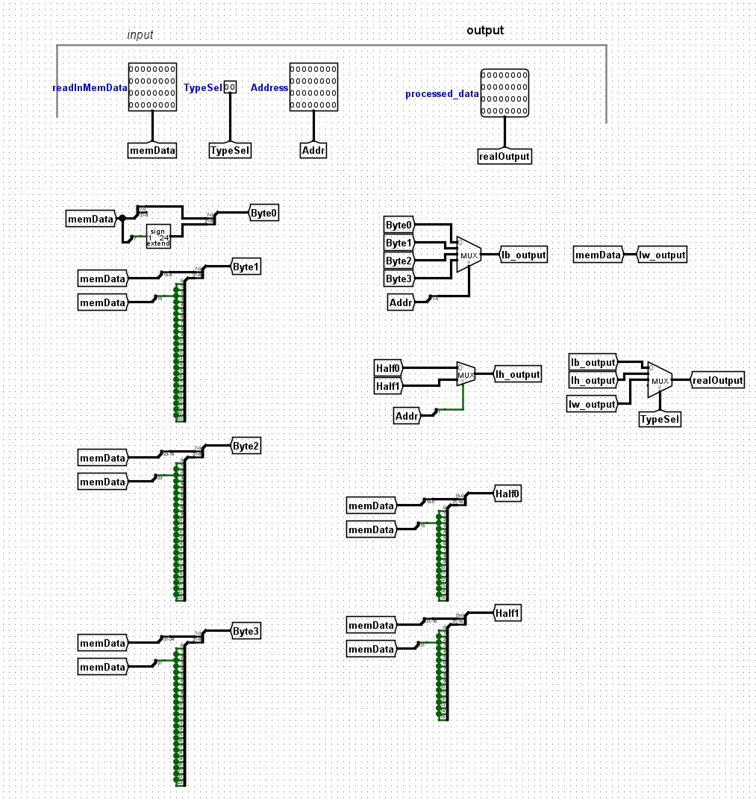

#### cpu-solution.circ

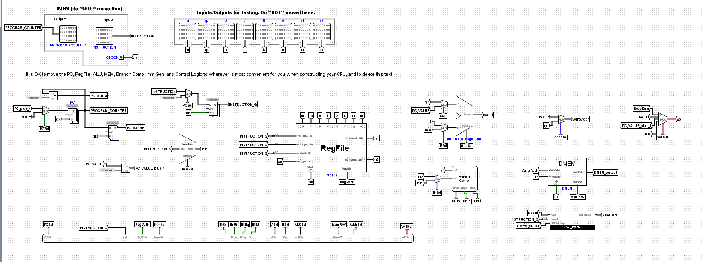

#### control_logic

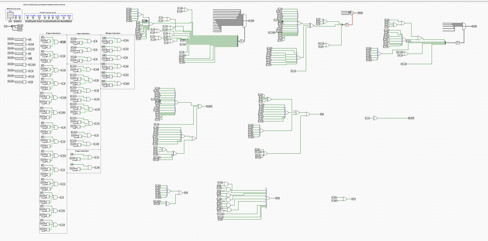

#### control_logic-solution

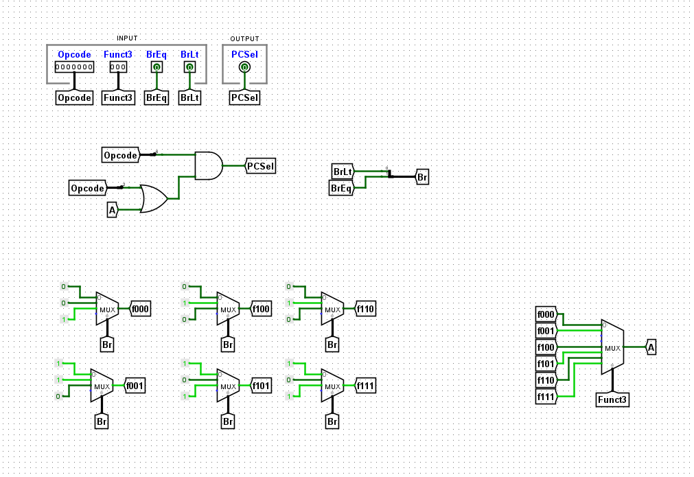

#### alu

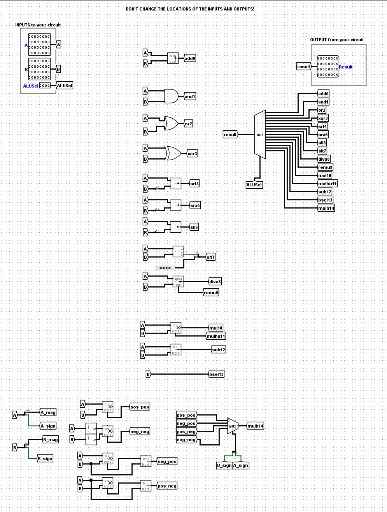

#### alu_harness

#### alu-solution

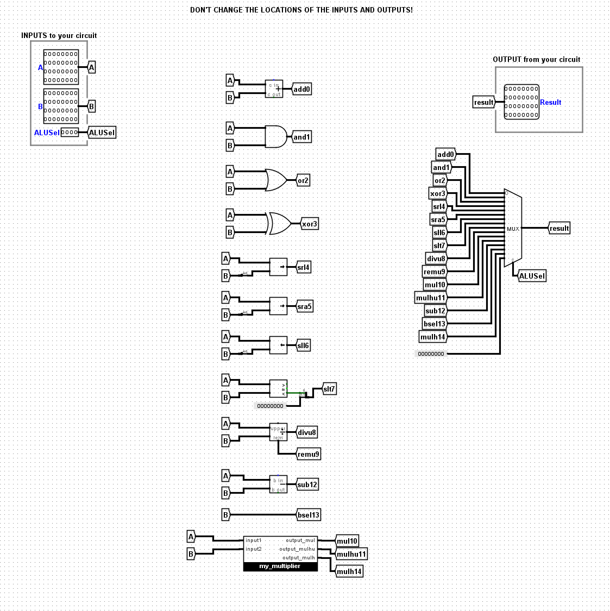

#### branch_comp

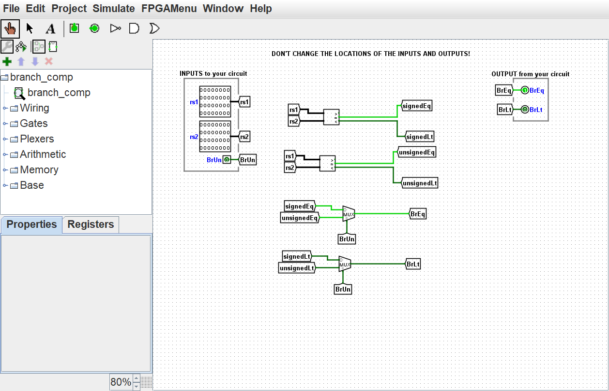

#### branch_comp-solution

#### imm_gen

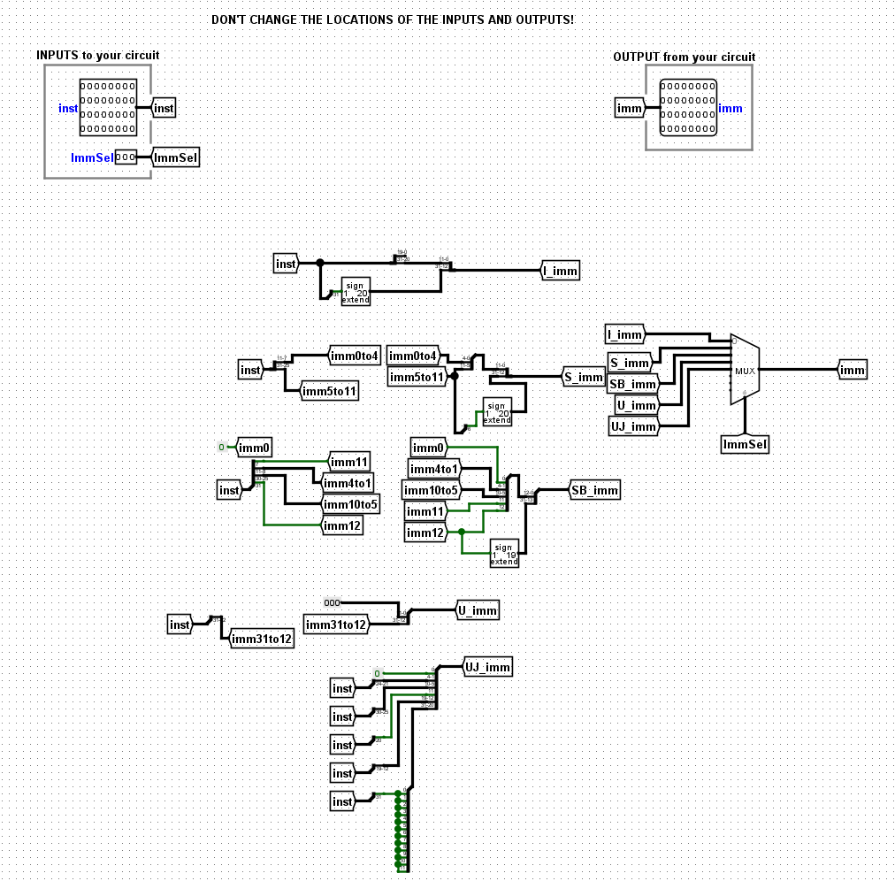

#### imm_gen-solution

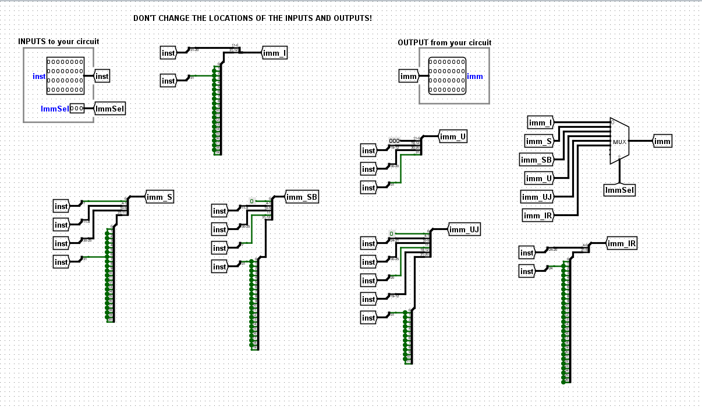

#### mem

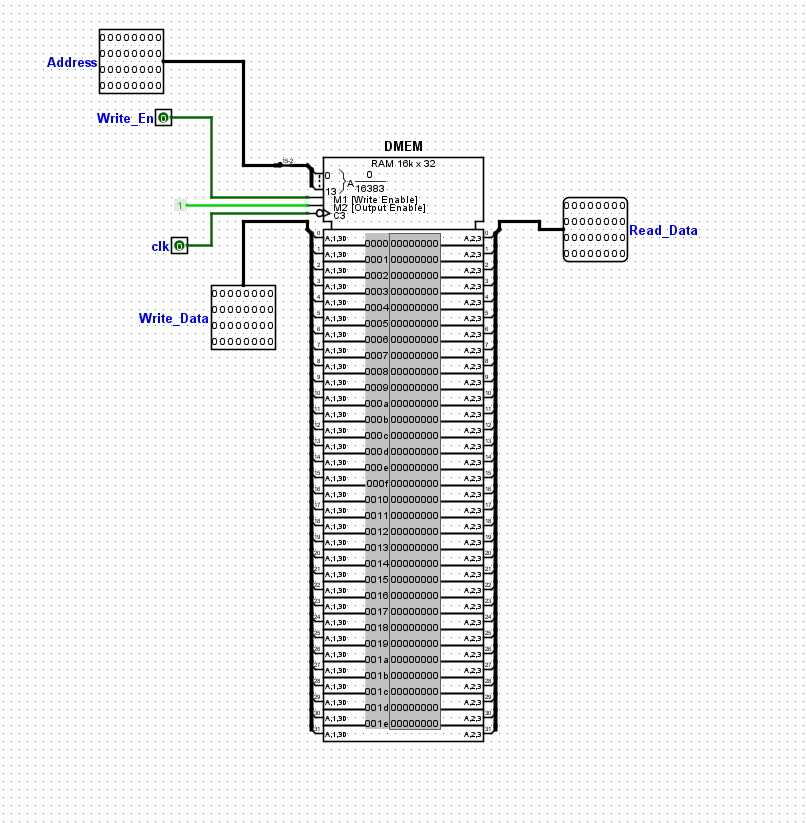

#### regfile

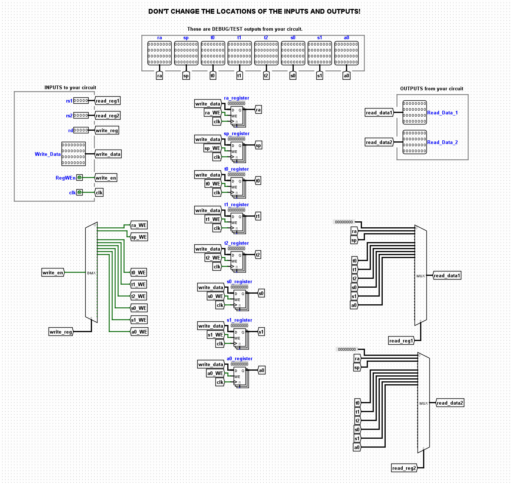

#### regfile_harness

#### run

