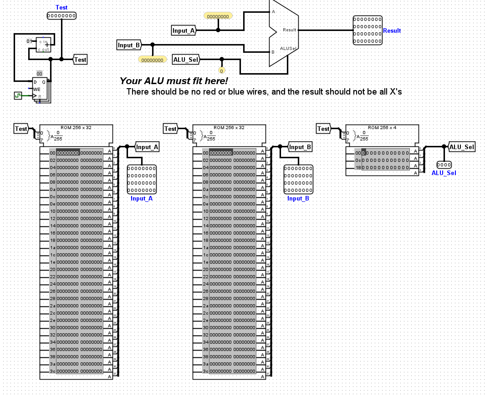
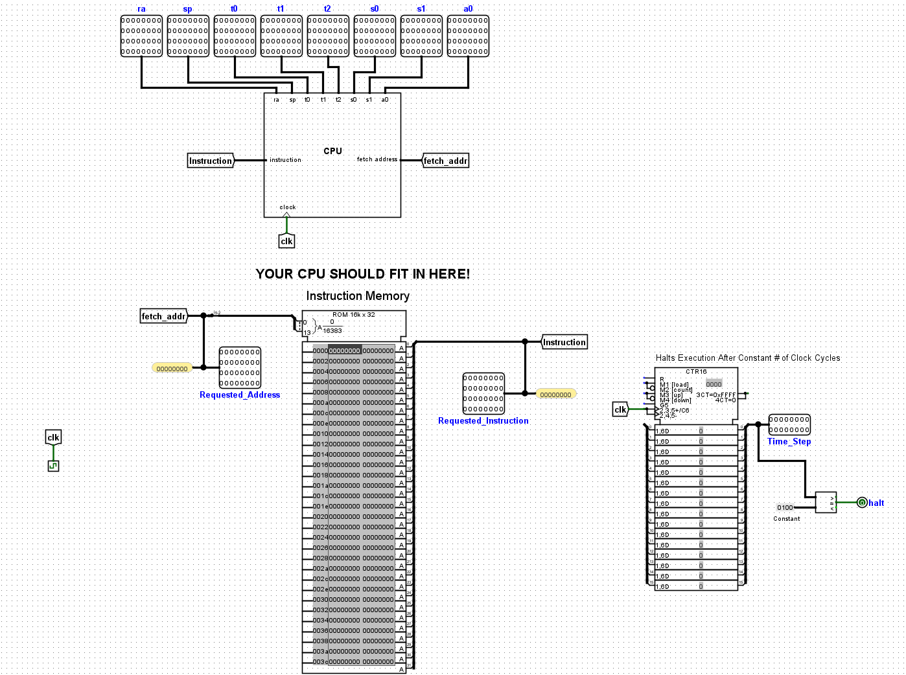

# CS61CPU

### usage

 This project runs on Logisim Evolution, a Java-based GUI program. To run it, in the project folder, runs ` java -jar logisim-evolution.jar`

### the design

#### cpu.circ

#### cpu-solution.circ

#### control_logic

#### control_logic-solution

#### alu

#### alu_harness

#### alu-solution

#### branch_comp

#### branch_comp-solution

#### imm_gen

#### imm_gen-solution

#### mem

#### regfile

#### regfile_harness

#### run

